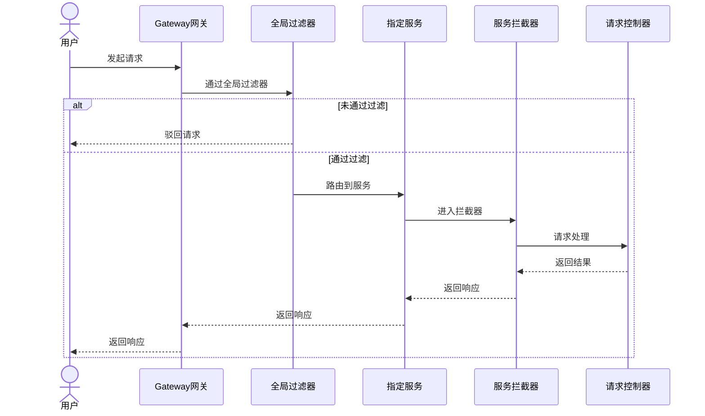
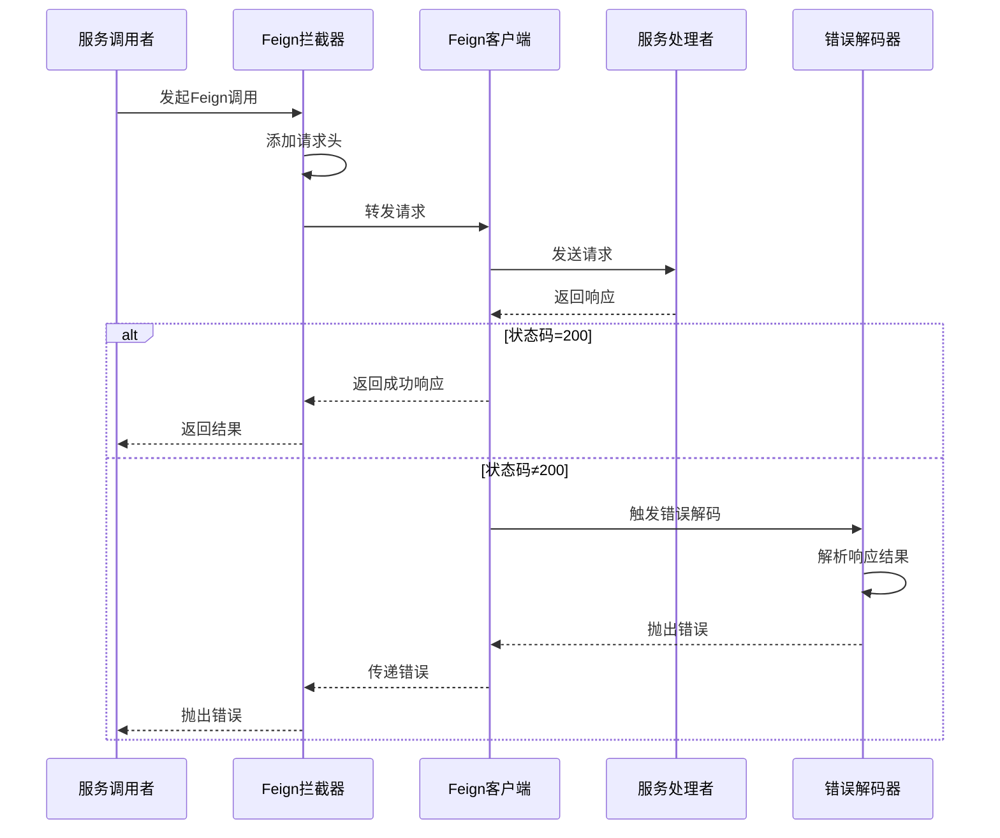
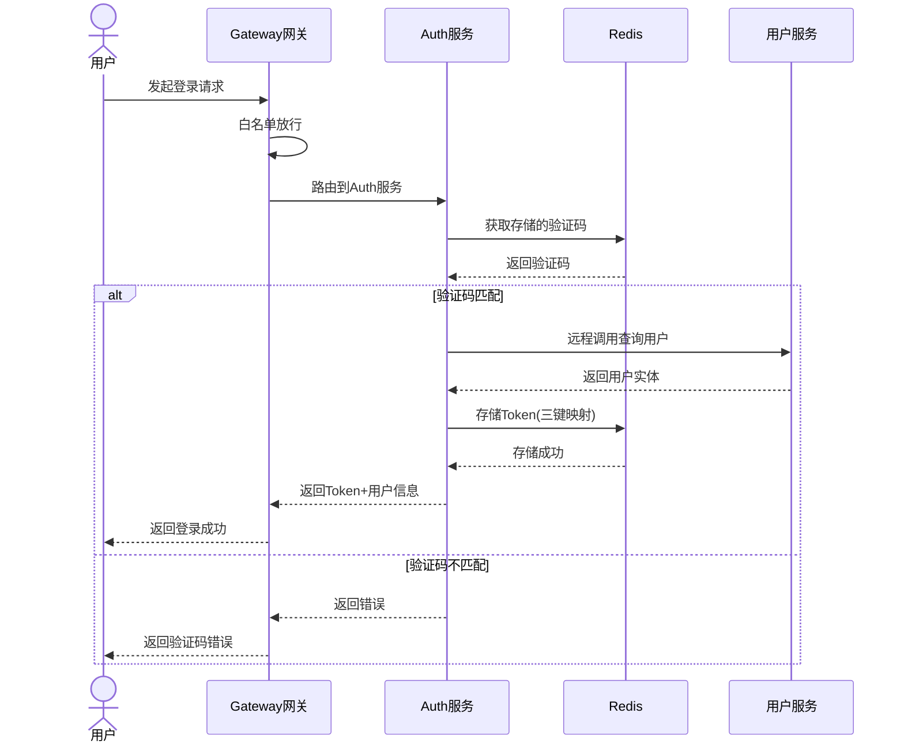

# lumen-forum后端

### 一、环境部署

本地必须有docker 所有的中间件和数据库都依赖docker

```
# redis镜像拉取和运行
docker run -d --name redis -p 6379:6379 redis:7.0

# mysql镜像拉取和运行
docker run -d --name mysql -p 3306:3306 -e MYSQL_ROOT_PASSWORD=123456 mysql:8.0

# nacos配置中心镜像拉取和运行
docker run -d --name nacos -p 8848:8848 -p 9848:9848 -p 9849:9849 -e MODE=standalone nacos/nacos-server:v2.2.0
```

唯一需要注意 nacos启动的时候不能只启动一个端口 否则其他服务无法注册 还需要开启另外两个端口 提供给服务注册

### 二、项目启动


### 三、项目详细

##### 1、请求的流程

用户发起请求--->gateway网关->通过全局过滤器过滤（未通过就直接驳回请求即可）-->路由到指定的服务-->该服务的拦截器-->请求控制器处理



##### 2、服务之间调用

服务调用发起者发起feign调用-->feign的拦截器拦截添加上下文请求头-->发起请求-->服务处理者处理请求-->处理完毕响应-->服务发起者方接收到响应，如果请求响应结果状态码为非200，则触发错误解码器解析响应结果然后抛出错误



##### 3、登录请求

用户发起请求->网关过滤器白名单直接放行并路由到auth服务-->auth服务接收请求然后处理：先从redis中获取验证码，和用户的验证码比对，一致则继续，反之则报错。然后发起远程调用查看用户是否存在，如果不存在则创建，存在则响应用户的实体类。获取到用户的实体类以后调用操作redis的方法，首先用UUID生成一个token这个token作为键映射用户的id，然后用户的id作为键映射用户的缓存信息，然后再将用户的id作为键使用redis的集合集合里面存储着所有指向这个id的token。完成这些缓存工作，就将token和缓存的用户信息作为响应体响应给前端




